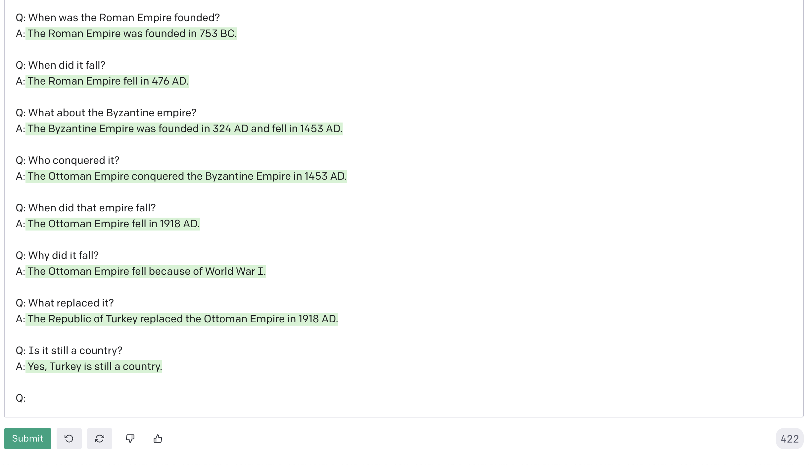

# Lessons From AI

    
    
    
    

    
    

## Application Description

An app that uses GPT-3 to display results from a user's text prompts. This app is for my job application to Shopify's Autumn 2022 Internship.

## The Challenge

You will write an app that sends plain text prompts to the OpenAI API and displays the results in a list.

We'd like your app to have a simple-to-use interface that includes the following:

- A form for entering text prompts
- Submitting the form sends the prompt to the OpenAI API
- Results are displayed in a list, sorted from newest to oldest. Each result should include the original prompt and a response from the API.

## Technical Requirements

1. Results should come from OpenAI’s completions API, for which you’ll need a free API key (no credit card required).
   - We’ve provided screenshots below of demo apps we built using the OpenAI API.
   - We recommend using the “text-curie-001” AI engine which is a good balance between speed, cost, and accuracy.
   - You are free to use any front end framework/component library you like (or none at all!)
2. Each result should include at least the original prompt you entered and the response from the API.
3. Responses should be stored in order of newest to oldest.
4. The HTML that ends up being served client-side should be accessible and semantic

## My Workflow

The first thing I did was read The Challenge included in the job application. I opened all the links included and then some more on OpenAI's website. After I finished my doc reading, I did a run through of their demo app and playground. Really enjoyed asking the AI history questions and watch it follow along.

It took me a while to get my prompts to work. I tried a few different tutorials and couldn't quite get them to match. I ended up repurposing the OpenAI quickstart app code. Once I got my prompt and API key working in the app, I started to work on the layout and style. However, while working on the styling, I encountered some issues with my API call. I think I had used too specific a train of thought and when I asked something unaligned, the answers got messed up.

## Improvements

1. Have the AI "learn" with each question. I would like to try and set the state after each question to include the user's question so that they could continue to ask questions and build to a conclusion of their questions.
2. Make the input box editable. I'd like the user to be able to go back to change or delete a question. Maybe the user didn't like a previous question or the answer to a question and wanted to redo the question(s). This would need to be reflected in state.

## Resources

Here's a list of resources I looked at that helped me figure things out. I didn't use everything in these tutorials but they gave me pieces to work with.

1. [OpenAI Quickstart](https://beta.openai.com/docs/quickstart)
2. [Harish Garb's Serverless Tutorial](https://harishgarg.com/writing/how-to-build-a-serverless-gpt-3-powered-using-nextjs-react/)
3. [Skolo Online's YouTube Tutorial](https://www.youtube.com/watch?v=Xxtu-bkSAB8)
4. [OpenAI Playground](https://beta.openai.com/playground)
